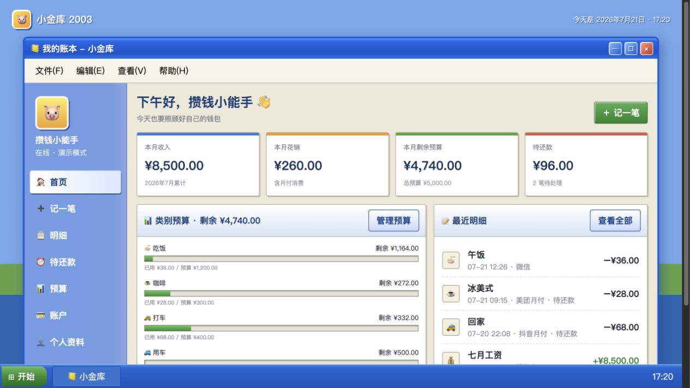
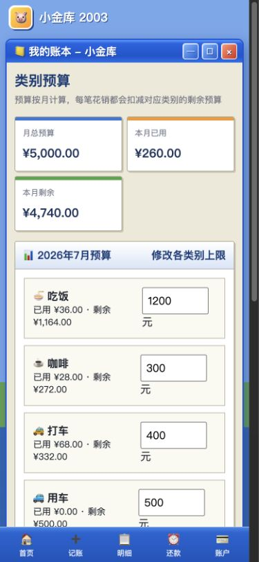
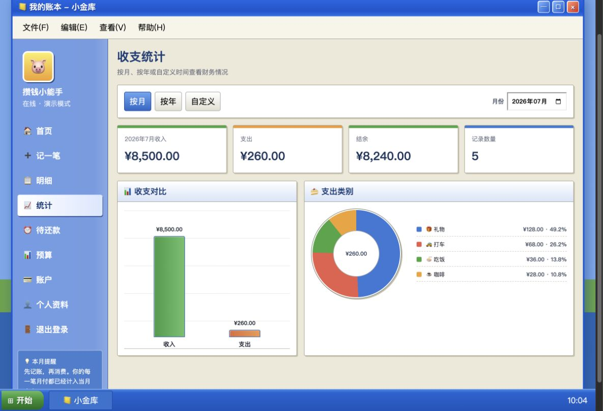
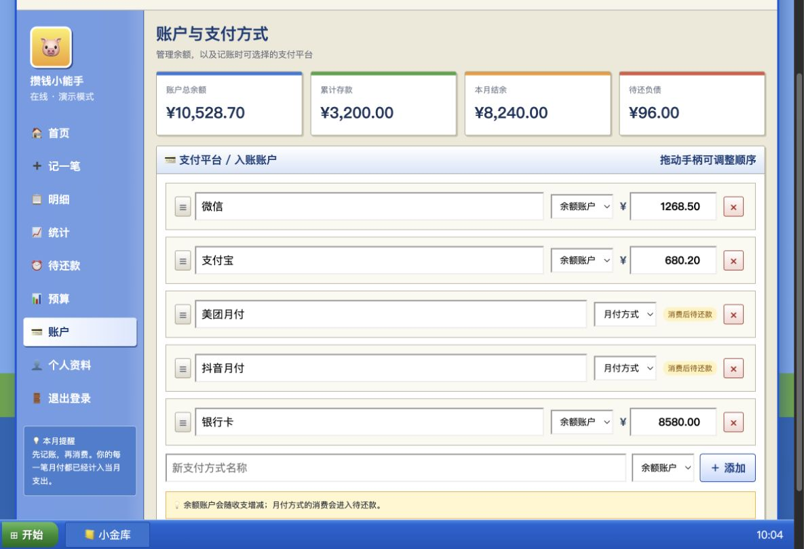
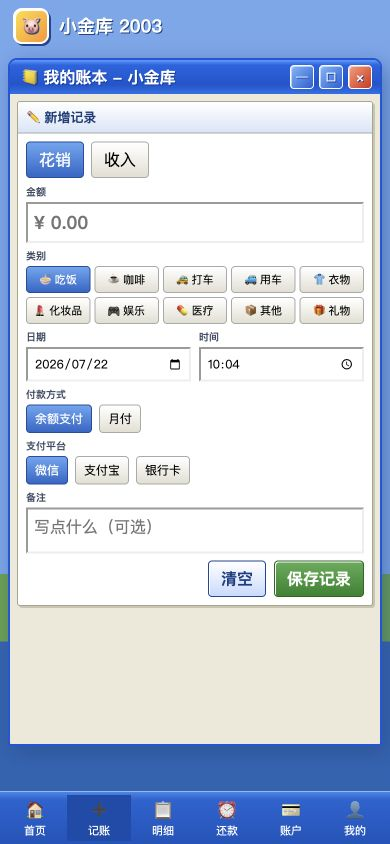
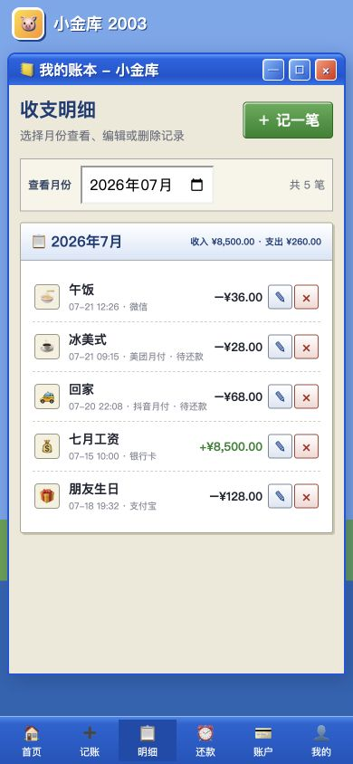

# 小金库 2003

一款 Windows XP / 老 QQ 风格的响应式个人记账网页。支持收入支出、分类预算、月付还款、统计图表和跨设备云同步，可在 iPhone 与电脑上使用。

在线体验：[xiaojinku-2003.pages.dev](https://xiaojinku-2003.pages.dev/)

## 当前版本

**v1.2.0**（2026-07-22）

- 新增真正的月度结余转存、存款提取、余额校准和存款流水
- 新增“我的”账户总览，集中显示账户总余额、存款、本月结余和待还负债
- 用户名和头像改为从“我的”跳转至独立个人资料页面编辑
- “账户”页面继续管理余额账户与月付方式，支持增删、编辑和拖动排序
- 优化手机端账户管理、日期时间、资料编辑和刷新体验
- 手机刷新会先同步云端数据，再完整刷新页面并返回原页面

版本号采用 `主版本.次版本.修订版本`：新增功能升级次版本，例如 `v1.2.0`；问题修复升级修订版本，例如 `v1.1.1`；不兼容的大改版才升级主版本。

## 效果图

### 电脑端首页



### 手机端预算



### 收支统计



### 支付方式管理



### 手机端记账



### 手机端明细



## 功能

- 记录、编辑和删除收入与花销，自动校正相关账户余额
- 按月份筛选收支明细
- 自定义消费类别，并通过拖动调整显示顺序
- 按类别设置月度预算，实时计算已用与剩余
- 自定义余额账户和月付方式，并通过拖动调整顺序
- 使用“余额支付 / 月付”二级菜单选择具体支付平台
- 单独管理美团月付、抖音月付等月付消费与还款
- 批量选择消费记录并从指定账户一键还款
- 按月、按年或自定义日期统计收入与支出
- 使用柱状图和饼图展示收支及类别占比
- 管理存款、月度结余、用户名和自定义头像
- 邮箱密码登录，使用 Supabase 跨设备同步
- 不同账号的云端数据和本地缓存相互隔离
- 免登录演示模式，不会读写云端账本

## 本地运行

项目没有构建依赖，启动任意静态文件服务器即可：

```bash
python3 -m http.server 4173
```

然后访问 `http://localhost:4173`。

## 配置 Supabase

1. 创建一个 Supabase 项目。
2. 在 SQL Editor 中执行 `supabase-schema.sql`。
3. 将 `src/main.js` 顶部的 `SUPABASE_URL` 和 `SUPABASE_KEY` 换成自己的项目值。
4. 在 Authentication → URL Configuration 中设置正式网站地址。
5. 将网页部署到 Cloudflare Pages 等静态托管平台。

`supabase-schema.sql` 会启用行级安全策略，每个账号只能访问自己的账本。

## 安全说明

前端只应使用 Supabase 的 publishable/anon key。不要提交 `service_role` key、数据库密码、账号密码或真实账本数据。

## License

[MIT](LICENSE)
